```mermaid
classDiagram
    direction LR
    class User {
        -id : PK
        -name : string
        -email : string
        -password : string
    }
    class Sona {
        -id : PK
        -userId : id
        -photo : blob
        -name : string
    }
    class Registration {
        -id : PK
        -userId : FK Unique
    }
    class Invoice {
        -id : PK
        -userId : FK
        -duedate : datetime
        -totalCost : real
    }
    class Payment {
        -id : PK
        -invoiceId : FK
        -type : string
        -payedOn : datetime
    }
    class Product {
        -id : PK
        -name : string
        -cost : float
        -description : string
    }
User "1" <--> "*" Sona : has
User "*" <--> "1" Invoice : creates
User "1" <--> "1" Registration :payFor
Invoice "1" <--> "1" Payment : fulfilled
Invoice "*" <--> "*" Product : madeOf
```

Users exist once someone creates an account.

Sonas are characters that users can add on the website for creation of badges. 

Registration table exists to handle the auto incrementation of users to be filled in once a user paid for their registration.

Invoices are ways for users to buy products linked to it

Products contain different services and 

Payments are the way to store the payment information and have greater control over preventing updates and deletes
